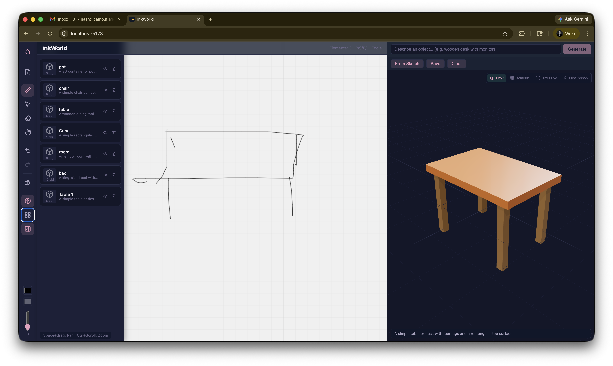

# inkWorld

A 3D room builder powered by AI and ink. Draw, describe, and compose 3D scenes from text prompts or hand-drawn sketches.



**Forked from [note-ai-inc/ink-ai-hack-playground](https://github.com/note-ai-inc/ink-ai-hack-playground)** — a React + TypeScript + Vite app for interactive ink-based elements with handwriting recognition.

## What We Built

inkWorld extends the original Ink Playground with:

- **Text-to-3D generation** — Type a description (e.g., "wooden desk with monitor") and Claude generates a 3D scene using Three.js primitives via OpenRouter
- **Sketch-to-3D** — Draw on the ink canvas, click "From Sketch", and AI interprets your drawing as 3D objects
- **Asset library** — Save generated 3D objects as reusable assets stored in browser localStorage
- **3D floor plan editor** — Arrange saved assets in a Three.js scene with PivotControls (move, rotate, scale)
- **Multiple camera views** — Bird's eye, isometric, orbit, and first-person walkthrough
- **Dark UI with Sundai Club theme** — Left sidebar tools, collapsible 3D panel, glassmorphism headers

### Architecture

```
┌──────┬─────────────────────┬──────────────────┐
│      │                     │  3D Viewer       │
│ Tool │   Ink Canvas        │  Text → 3D       │
│ Bar  │   or                │  Sketch → 3D     │
│      │   Floor Plan        │  Save/Clear      │
│      │                     │  Camera modes    │
└──────┴─────────────────────┴──────────────────┘
```

**New files added:**
| File | Purpose |
|------|---------|
| `src/ai/AnthropicService.ts` | Claude via OpenRouter — text-to-3D and sketch-to-3D |
| `src/components/ThreeViewer.tsx` | React Three Fiber 3D viewer with camera modes |
| `src/components/FloorView.tsx` | 3D floor plan editor with PivotControls |
| `src/components/AssetPanel.tsx` | Asset library flyout panel |
| `src/services/AssetStore.ts` | localStorage persistence for assets and floor items |

## Original Ink Playground Features

The fork retains all original capabilities:

- Interactive ink canvas with handwriting recognition via REST API
- Plugin-based element system (16 element types including games, shapes, text)
- Scribble-based eraser with stroke splitting
- Undo/redo, pan/zoom, lasso selection
- See `docs/New element HOWTO.md` for adding new element types

## Getting Started

### Prerequisites
- Node.js (v18+)
- npm

### Installation
```bash
git clone https://github.com/note-ai-inc/ink-ai-hack-playground.git
cd ink-ai-hack-playground
npm install
```

### Environment Setup
```bash
cp .env.example .env
```

Required variables:
| Variable | Description |
|----------|-------------|
| `INK_OPENROUTER_API_KEY` | OpenRouter API key for AI generation ([get one](https://openrouter.ai/keys)) |
| `INK_RECOGNITION_API_URL` | Handwriting recognition API endpoint (optional) |

### Running
```bash
npm run dev      # Start dev server (http://localhost:5173)
npm run build    # Production build
npm run lint     # ESLint check
```

### Tablet Testing
The dev server is exposed on all network interfaces:
```bash
adb reverse tcp:5173 tcp:5173
# Browse to localhost:5173 on the tablet
```

## Tech Stack

- **React 19** + **TypeScript 5.9** + **Vite 7**
- **Three.js** + **React Three Fiber** + **drei** (3D rendering, controls)
- **OpenRouter SDK** → Claude Sonnet 4 (AI generation)
- **lucide-react** (icons)
- **localStorage** (asset/floor persistence)

## Docs

- [Overview](docs/Overview.md) — Core concepts and architecture
- [Plugin Architecture](docs/Plugin%20Architecture.md) — Element plugin system
- [Recognition and AI](docs/Recognition%20and%20AI.md) — API integrations
- [Getting Started](docs/Getting%20Started.md) — Setup and dev flow
- [Hack Ideas](docs/Hack%20Ideas.md) — Project ideas
- [New Element HOWTO](docs/New%20element%20HOWTO.md) — Step-by-step guide for new elements

## Built at Sundai Club Hack — March 29, 2026
